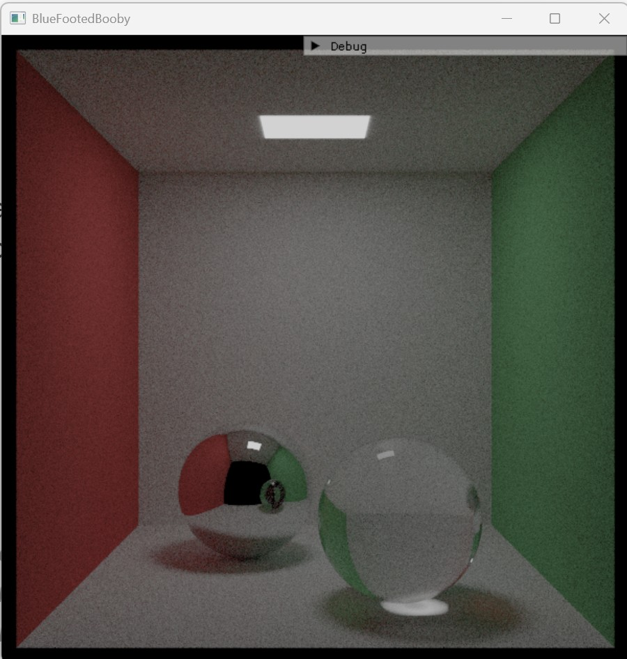
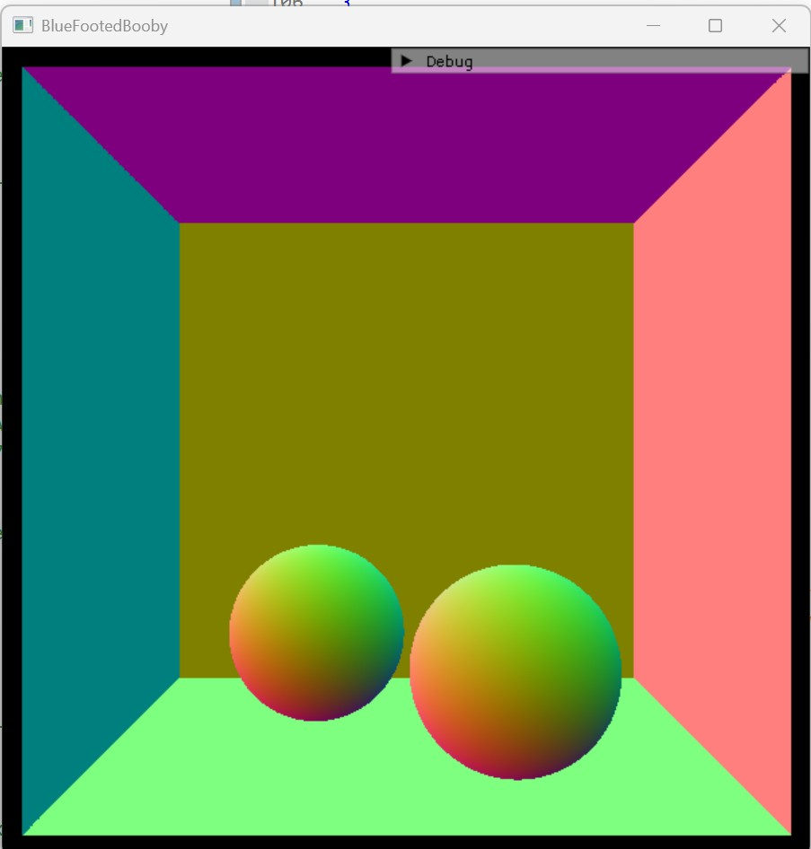

# 🐦 Blue-Footed Booby - Monte Carlo Path Tracer (C++)

> A physically-based renderer built **from scratch** in C++ - no rendering libraries - that
> simulates real light transport (global illumination, soft shadows, glass, metal).

<p align="center">
  <br>
  <sub><i>Cornell Box - path-traced with global illumination, a glass sphere, and a metal sphere.</i></sub>
</p>

---

## Table of Contents
1. [Motivation](#motivation)
2. [Overview](#overview)
3. [Gallery](#gallery)
4. [How It Works](#how-it-works)
5. [Technical Highlights](#technical-highlights)
6. [Performance](#performance)
7. [Architecture](#architecture)
8. [Roadmap](#roadmap)
9. [References](#references)

---

## Motivation

My eyes render the world automatically - the way a light source delicately interacts with every
material around it, moment to moment. I kept coming back to one question: **how would I draw *that*
on a screen?** Not "how do I use a game engine?" but *why* does light look the way it does, and how
do you reproduce it from first principles?

I built this to answer that question for myself.

---

## Overview

**What it is:** a **Monte Carlo path tracer** built from scratch in modern C++ that renders the classic
Cornell Box with physically-based light transport.

**"From scratch" means:** all ray/light-transport code is mine. The dependencies are
**GLM** (vector math), **Dear ImGui** (debug UI), and **DirectX 11** - which only *displays* the
finished CPU-rendered frame; it does no rendering itself, though a GPU renderer is on the roadmap.

**Highlights**
- Monte Carlo integration of the rendering equation (diffuse global illumination)
- Emissive **area lights** - soft shadows and color bleeding
- **Dielectric (glass)** - Fresnel reflectance, refraction, total internal reflection
- **Metal** - mirror reflection with adjustable roughness
- **Cosine-weighted importance sampling**, tone-mapping + gamma
- Real-time **DirectX 11** viewport with live debug views (normals / depth / albedo)

---

## Gallery

<p align="center">
  
  <br>
  <sub><i>Left: the metal sphere mirrors the room. Right: the glass sphere added - note the red/green <b>color bleeding</b> on the floor from indirect light.</i></sub>
</p>

<p align="center">
  
  <br>
  <sub><i>Building with verification: the <b>normals</b> debug view (left) confirms geometry orientation before any lighting; an early rectangle-intersection test (right).</i></sub>
</p>

---

## How It Works

This is the life of a single pixel, start to finish.

1. **Cast a ray** from the camera through the pixel (pinhole camera).
2. **Sample many times** - fire N jittered rays per pixel (anti-aliasing + Monte Carlo sampling).
3. **Find the nearest surface** - where the ray hits.
4. **Scatter or Emit** - the surface's material decides how the ray bounces (diffuse / mirror /
   glass) and whether it glows.
5. **Follow the path** - recurse along the bounce, gathering light:
   `emitted + albedo × (light from the rest of the path)`.
6. **Average** the N samples → an estimate of the true light reaching that pixel.
7. **Tone-map + Gamma** the linear HDR result down to a displayable color.
8. **Display** via DirectX 11.

**The core idea:** the color of a pixel is an **integral** over every path light could take to
reach it, which is impossible to solve directly. So I estimate it with **Monte Carlo**, tracing many random
light paths and calculating the average. Global illumination, soft shadows, and color bleeding all *emerge* from
this.

---

## Technical Highlights

### Monte Carlo integration of the rendering equation
Each pixel is an integral over all incoming light; I estimate it by averaging random paths. Noise
falls as **1/√N**, so halving it costs **4×** the samples - the central performance tension of the
whole renderer. The integrator itself is small - it *is* the rendering equation, written as a single
unbranching recursive path:

```cpp
// One random, unbranching light path (backward, from the camera).
math::vec3 tracePath(Ray ray, int depth, RNG& rng)
{
    if (depth <= 0)          return math::vec3(0.0f);   
    Hit hit = FindNearestCollision(ray);
    if (hit.d < 0.0f)        return math::vec3(0.0f);   

    math::vec3 emitted = hit.obj->material->Emitted();

    Ray scattered;  math::vec3 attenuation;
    if (hit.obj->material->Scatter(ray, hit, rng, attenuation, scattered))
        return emitted + attenuation * tracePath(scattered, depth - 1, rng);
    return emitted;                                     
}
```

<p align="center">
  
  
  <br>
  <sub><i>The same scene at <b>1 / 16 / 128</b> samples per pixel - Monte Carlo noise converging as 1/√N.</i></sub>
</p>

### Materials as a polymorphic interface
`Material` is an abstract base with two virtual methods: `Scatter()` (how a ray bounces off the
surface) and `Emitted()` (light the surface emits). `Lambertian`, `Metal`, `Dielectric`, and
`DiffuseLight` implement them. Geometry and shading are decoupled: each `Object` holds a `Material*`,
and `tracePath` calls `Scatter()` / `Emitted()` through the base pointer without branching on the
material type.

The tradeoff is a virtual call per ray-surface hit. A data-oriented approach - grouping hits by
material and shading each group in one loop - removes that indirection, which is what production
renderers do.

```cpp
class Material {
public:
    virtual math::vec3 Emitted() const { return math::vec3(0.0f); }
    virtual bool Scatter(const Ray& in, const Hit& hit, RNG& rng,
                         math::vec3& attenuation, Ray& scattered) const = 0;
};

// Matte surface: bounce in a cosine-weighted random direction.
class Lambertian : public Material {
    math::vec3 albedo;
public:
    bool Scatter(const Ray& in, const Hit& hit, RNG& rng,
                 math::vec3& attenuation, Ray& scattered) const override {
        math::vec3 dir = hit.normal + rng.randomUnitVector();  // → cosine lobe
        scattered   = { hit.point + hit.normal * 1e-3f, math::normalize(dir) };
        attenuation = albedo;                                  // the PDF cancels the cosine term
        return true;
    }
};
```

### Glass: Fresnel, refraction, and total internal reflection
The dielectric picks reflection or refraction per sample, weighted by the **Fresnel** reflectance
(Schlick approximation), handles **total internal reflection**, and correctly switches between
air→glass and glass→air. Averaged over samples, it reproduces the correct reflect/refract blend.

### From HDR light to a displayable image (tone-map + gamma)
The renderer works in unbounded **linear light**, and compresses to a displayable image only at the
very end - **Reinhard tone-mapping** (so bright highlights don't clip to flat white) followed by
**gamma correction** (so midtones aren't crushed). Skipping it leaves the raw render dark and muddy:

<p align="center">
  
  <br>
  <sub><i>Before (raw linear output) → after (Reinhard tone-map + gamma).</i></sub>
</p>

### Why trace *backward* (from the camera)
Physically, light flows from the source → surfaces → camera, but I trace the reverse. It's valid because light
transport is **reversible**, and it's far more efficient: starting at the camera, **every ray
contributes to a pixel**, whereas photons fired from the light would almost never reach the camera.

---

## Performance

> **[Phase 2 - in progress]** The renderer is currently **single-threaded** - ~19 s per frame at
> 128 spp (600×600). Next: a hand-built **tile-based thread pool** to parallelize across cores.

### Single-threaded baseline - render time vs. samples-per-pixel
Measured with a `steady_clock` harness (600×600, max depth 8, one thread):

| spp | Render time |
|---:|---:|
| 1 | 0.52 s |
| 2 | 0.65 s |
| 4 | 0.93 s |
| 8 | 1.48 s |
| 16 | 2.57 s |
| 32 | 4.90 s |
| 64 | 9.44 s |
| 128 | 19.09 s |

Render time scales **roughly linearly** with samples at higher counts (64 → 128 spp ≈ 2×), with
fixed per-pixel overhead dominating at very low sample counts. This **19 s @ 128 spp** is the
baseline the thread pool below has to beat.

### Multithreaded speedup *(Phase 2 - coming)*
| Threads | Render time | Speedup | Efficiency |
|---:|---:|---:|---:|
| 1 | 19.09 s | 1.0× | - |
| 2 | [FILL] s | [FILL]× | [FILL]% |
| 4 | [FILL] s | [FILL]× | [FILL]% |
| 8 | [FILL] s | [FILL]× | [FILL]% |

_A tile-progress GIF (tiles completing in parallel across worker threads) will go here once the
thread pool is built (Phase 2)._

**Design:** worker threads pull tiles off a shared work queue (`std::mutex` + `std::condition_variable`).
A **work queue rather than a static split** because some tiles (the glass sphere) are far slower than
others - dynamic distribution balances the load. The per-pixel deterministic RNG means **no locks on
the pixel-write path**.

---

## Architecture

- `Camera` - generates primary rays (pinhole).
- `Object` (→ `Sphere`, `Rect`) - geometry / ray intersection.
- `Material` (→ `Lambertian`, `Metal`, `Dielectric`, `DiffuseLight`) - shading / scattering.
- `Raytracer` - scene + the `tracePath` integrator + sampling loop.
- `Renderer` - DirectX 11 display of the CPU framebuffer.

---

## Roadmap
- **Multithreading** - tile-based thread pool + benchmark (in progress)
- **Next-event estimation** - sample the light directly for much less noise
- **Golden-image regression tests + CI** - verify renders don't drift

---

## References
- *Ray Tracing in One Weekend* - Peter Shirley
- The Cornell Box - Cornell University Program of Computer Graphics
