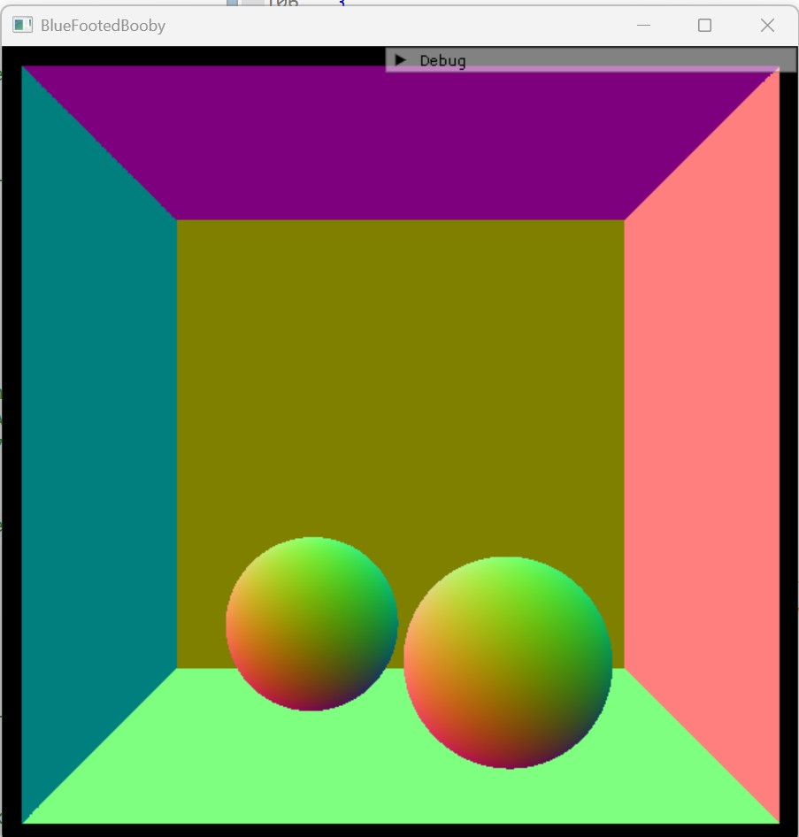

# 🐦 Blue-Footed Booby - Monte Carlo Path Tracer (C++)

> A physically-based renderer built **from scratch** in C++ - no rendering libraries - that
> simulates real light transport (global illumination, soft shadows, glass, metal).

<p align="center">
  <br>
  <sub><i>Cornell Box - path-traced with global illumination, a glass sphere, and a metal sphere.<br>
  1024 samples/pixel, max path depth 16, 1200×1200 - a sample budget the 10× parallel speedup made affordable.</i></sub>
</p>

---

## Project Summary

I do not have to tell my eyes how to render the world. They just do it for me automatically - the way a light source delicately interacts with every
material around it, moment to moment. I kept coming back to one question: **how would I draw *that*
from first principles?** Not "how do I use a game engine?" but *why* light looks the way it does. I
built this to answer that question for myself.

**Blue-Footed Booby is a Monte Carlo path tracer written from scratch in modern C++**, rendering the
classic Cornell Box with physically-based light transport. "From scratch" means I programmed every
ray/light-transport line. The dependencies are **GLM** (vector math), **Dear ImGui**
(debug UI), and **DirectX 11** - which merely *displays* the finished CPU-rendered frame, a GPU
renderer being on the roadmap in the future.

- ⚡ **~10× faster** with a my own tile-based thread pool - a 128 spp frame at 1200×1200 from **77 s → 7.8 s** (AMD Ryzen 7 9700X, 8-core / 16-thread), verified pixel-identical to the serial render
- 🌐 **Monte Carlo global illumination** - soft shadows and color bleeding *emerge* from the rendering equation
- 🔬 **Physically-based materials** - dielectric glass (Fresnel + refraction + total internal reflection) and metal (mirror + roughness)
- 🎚️ **Cosine-weighted importance sampling**, Reinhard tone-mapping + gamma
- 🖥️ Real-time **DirectX 11** viewport with live debug views (normals / depth / albedo)

---

## Performance

> **[Phase 2]** A 128 spp frame at 1200×1200 renders in **7.8 s instead of 77 s** - a **~10×
> speedup** on an AMD Ryzen 7 9700X (8-core / 16-thread). Two parallel back-ends are implemented and
> benchmarked against each other: C++17 `std::execution::par`, and a **hand-built tile-based thread
> pool**.

### Decision to use multithreading after finding out  one frame took 77 seconds to render
A clean image needs many samples per pixel, and every sample costs the same. On one thread a 128 spp
frame took **77 seconds**, and a genuinely clean image wants 1024 spp - roughly ten minutes per
render. At that speed, it takes so much time to program, compile, run, and verity the scene.

Two properties of the renderer made parallelising it straightforward:

- **Every pixel is independent.** A pixel's colour never depends on another pixel's result, so there
  is nothing to coordinate beyond handing out the work.
- **There is no shared state to lock.** Each pixel seeds its own random number generator from
  `(x, y, sample)`, so no two threads ever touch the same data.

### Comparing three ways to render the same frame

Measured with a `steady_clock` harness (1200×1200, max depth 8, Release build, Ryzen 7 9700X,
16 worker threads, 32×32 tiles).

Each cell is wall-clock render time; the figure in parentheses is the speedup over the serial run.

| spp | Serial (1 thread) | `std::execution::par` | Tiled thread pool | Pixel diff |
|---:|---:|---:|---:|---:|
| 1 | 2.034 s | 0.179 s (11.35×) | 0.175 s (11.59×) | 0 |
| 4 | 3.807 s | 0.351 s (10.85×) | 0.348 s (10.93×) | 0 |
| 16 | 10.629 s | 1.027 s (10.35×) | 1.017 s (10.45×) | 0 |
| 64 | 39.083 s | 3.863 s (10.12×) | 3.863 s (10.12×) | 0 |
| 128 | 77.249 s | 7.733 s (9.99×) | 7.784 s (**9.92×**) | 0 |

The last column checks correctness. Because the random number generator is seeded from the pixel
coordinate, dividing the work differently must not change a single pixel, so the benchmark also
compares the three framebuffers against each other. All 1.44 M pixels match exactly in every run. A
data race would show up here as a scattering of differing pixels, which a benchmark that only
measures time would miss.

The hand-built pool lands within ~1% of `std::execution::par` (backed by Intel TBB on MSVC) - a gap
small enough to be measurement noise. Most of the gain comes from using all cores at all; the
scheduling strategy on top, rows versus 32×32 tiles, matters less on this scene, where even a single
1200-pixel row already mixes cheap wall and expensive glass.

### Speedup from 1 to 16 threads

This table is the reason for writing the pool by hand: `std::execution::par` gives no control over
thread count, so it cannot produce these measurements at all. (64 spp, 1200×1200.)

| threads | time | speedup | efficiency |
|---:|---:|---:|---:|
| 1 | 37.851 s | 1.00× | 100.0% |
| 2 | 24.064 s | 1.57× | 78.7% |
| 4 | 12.652 s | 2.99× | 74.8% |
| 8 | 6.446 s | 5.87× | 73.4% |
| 12 | 4.594 s | 8.24× | 68.7% |
| 16 | 3.819 s | 9.91× | 61.9% |

The number worth explaining is not the 61.9% at the end but the **21-point drop between one thread
and two**. Losing that much by adding a single thread is more than imperfect parallelism accounts
for, so I measured the obvious suspect: CPU clock speed, which drops as more cores become busy.

| threads | clock |
|---:|---:|
| 1 | 5.45 GHz |
| 2 | 5.29 GHz |
| 16 | 4.88 GHz |

The measurement only partly supported the hypothesis. At 16 threads the clock is 10.5% lower, which
does explain a real share of the shortfall - correcting for it turns 9.91× into **11.07×**. But at
*two* threads the clock is only 2.9% lower, which accounts for about 3 of the 21 lost points.

Correcting every measurement for clock speed narrows the anomaly to one place: from 2 to 16 threads
(8× the workers) throughput rises **6.83×, an 85% scaling efficiency**. The parallel range scales
well, and it is the single-threaded measurement that is unusually fast. Two untested explanations
remain: a lone thread has the entire 32 MB L3 cache to itself, and thread placement is left to the
operating system, so two threads may end up on the two hardware threads of one physical core instead
of on two separate cores. Neither has been verified, so neither is claimed here.

### Spending the speedup on image quality
The point was never a shorter wait. Monte Carlo noise falls as `1/√N`, so the time that previously
bought 128 spp now buys **1024 spp - a 2.8× cleaner render**, which is what the image at the top of
this page is. Interactive debug views stay at a low sample count for instant feedback, and the
sample budget goes where it shows.

_A tile-progress GIF (tiles completing in parallel across worker threads) is still to come._

---

## Gallery

<p align="center">
  
  <br>
  <sub><i>Left: the metal sphere mirrors the room. Right: the glass sphere added - note the red/green <b>color bleeding</b> on the floor from indirect light.</i></sub>
</p>

<p align="center">
  
  <br>
  <sub><i>Building with verification: the <b>normals</b> debug view (left) confirms geometry orientation before any lighting; an early rectangle-intersection test (right).</i></sub>
</p>

---

## How a single pixel gets its colour

Start to finish, for one pixel:

1. **Cast a ray** from the camera through the pixel (pinhole camera).
2. **Sample many times** - fire N jittered rays per pixel (anti-aliasing + Monte Carlo sampling).
3. **Find the nearest surface** - where the ray hits.
4. **Scatter or Emit** - the surface's material decides how the ray bounces (diffuse / mirror /
   glass) and whether it glows.
5. **Follow the path** - recurse along the bounce, gathering light:
   `emitted + albedo × (light from the rest of the path)`.
6. **Average** the N samples → an estimate of the true light reaching that pixel.
7. **Tone-map + Gamma** the linear HDR result down to a displayable color.
8. **Display** via DirectX 11.

The colour of a pixel is an integral over every path light could take to reach it, which cannot be
solved directly. It is estimated instead with **Monte Carlo** sampling: trace many random light paths
and average them. Global illumination, soft shadows, and colour bleeding are not special-cased
anywhere - they fall out of this.

---

## Implementation details

### Estimating light by tracing random paths
Each pixel is an integral over all the light arriving at it, which cannot be solved directly, so it
is estimated by averaging many random paths. Noise falls as **1/√N**, meaning halving it costs **4×**
the samples - the tension that drives every performance decision in the renderer. The integrator
itself is short: it is the rendering equation, written as one unbranching recursive path.

```cpp
// One random, unbranching light path (backward, from the camera).
math::vec3 tracePath(const Ray ray, int depth, RNG& rng)
{
    if (depth <= 0) return math::vec3(0.0f);   
    Hit hit = FindClosestCollision(ray);
    if (hit.distance < 0.0f) return math::vec3(0.0f);   

    math::vec3 emitted = hit.obj->material->Emitted();

    Ray scattered;  math::vec3 attenuation;
    if (hit.obj->material->Scatter(ray, hit, rng, attenuation, scattered))
        return emitted + attenuation * tracePath(scattered, depth - 1, rng);
    return emitted;                                     
}
```

<p align="center">
  
  
  
  <br>
  <sub><i>The same scene at <b>1 / 16 / 128 / 1024</b> samples per pixel - Monte Carlo noise converging as 1/√N.<br>
  Every other parameter is held fixed; only the sample count changes. Each step is 8× the samples for
  ~2.8× less noise - visibly diminishing returns, and the reason the 10× speedup mattered.</i></sub>
</p>

### One material interface, four surface types
`Material` is an abstract base with two virtual methods: `Scatter()` (how a ray bounces off the
surface) and `Emitted()` (light the surface emits). `Lambertian`, `Metal`, `Dielectric`, and
`DiffuseLight` implement them. Geometry and shading are decoupled: each `Object` holds a `Material*`,
and `tracePath` calls `Scatter()` / `Emitted()` through the base pointer without branching on the
material type.

The tradeoff is a virtual call per ray-surface hit. A data-oriented approach - grouping hits by
material and shading each group in one loop - removes that indirection, which is what production
renderers do.

```cpp
class Material {
public:
    virtual math::vec3 Emitted() const { return math::vec3(0.0f); }
    virtual bool Scatter(const Ray& in, const Hit& hit, RNG& rng,
                         math::vec3& attenuation, Ray& scattered) const = 0;
};

// Matte surface: bounce in a cosine-weighted random direction.
class Lambertian : public Material {
    math::vec3 albedo;
public:
    bool Scatter(const Ray& in, const Hit& hit, RNG& rng,
                 math::vec3& attenuation, Ray& scattered) const override {
        math::vec3 dir = hit.normal + rng.randomUnitVector();  // → cosine lobe
        scattered   = { hit.point + hit.normal * 1e-3f, math::normalize(dir) };
        attenuation = albedo;                                  // the PDF cancels the cosine term
        return true;
    }
};
```

### Glass: choosing between reflection and refraction
The dielectric picks reflection or refraction per sample, weighted by the **Fresnel** reflectance
(Schlick approximation), handles **total internal reflection**, and correctly switches between
air→glass and glass→air. Averaged over samples, it reproduces the correct reflect/refract blend.

### Turning unbounded light values into screen colours
The renderer works in unbounded **linear light**, and compresses to a displayable image only at the
very end - **Reinhard tone-mapping** (so bright highlights don't clip to flat white) followed by
**gamma correction** (so midtones aren't crushed). Skipping it leaves the raw render dark and muddy:

<p align="center">
  
  <br>
  <sub><i>Before (raw linear output) → after (Reinhard tone-map + gamma).</i></sub>
</p>

---

## Roadmap
- ✅ **Parallel rendering** - `std::execution::par` and a hand-built tile-based thread pool
  (`std::mutex` + `std::condition_variable` + work queue), **~10× speedup**, benchmarked against each
  other and verified pixel-identical ([Performance](#performance))
- **Verify the scaling anomaly** - measure whether L3 sharing or SMT thread placement explains the
  1 → 2 thread efficiency drop (thread affinity experiment)
- **Next-event estimation** - sample the light directly for much less noise
- **Golden-image regression tests + CI** - verify renders don't drift

---

## References
- *Ray Tracing in One Weekend* - Peter Shirley
- The Cornell Box - Cornell University Program of Computer Graphics
